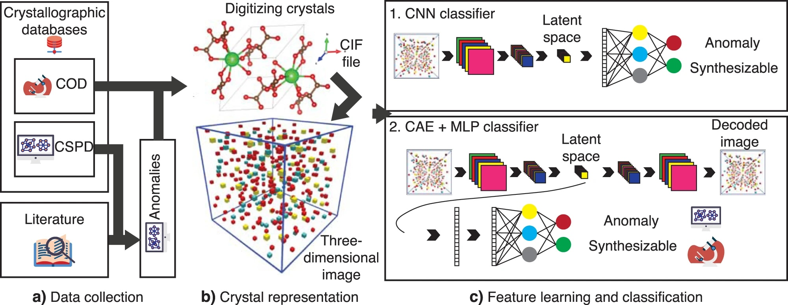
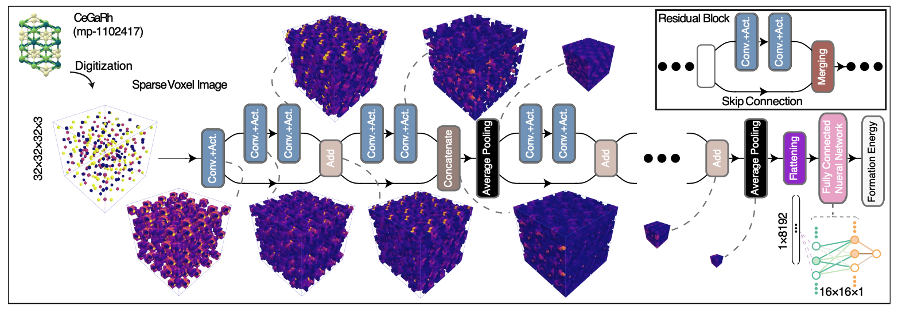
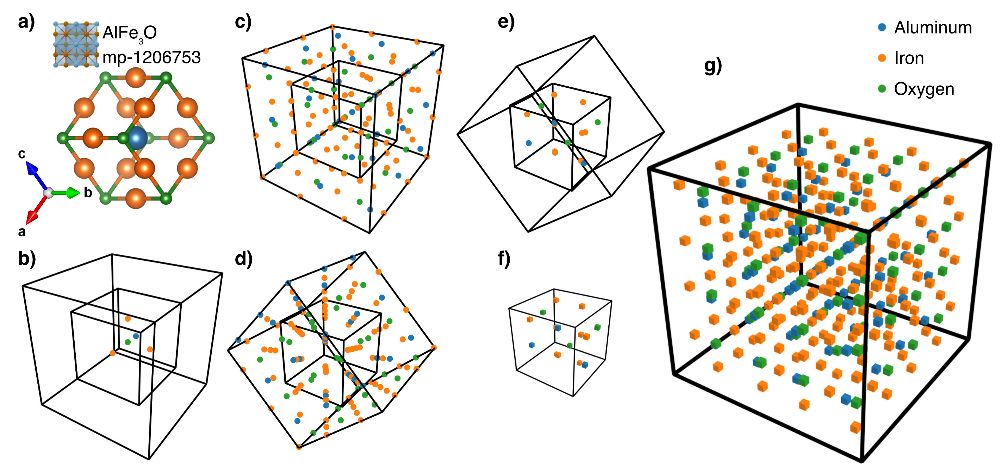

# XIE-SPP: Crystal Image Encoder for Synthesis & Property Prediction

[LICENSE](https://creativecommons.org/licenses/by-nd/4.0/)

This code has been developed by Ali Davariashtiyani. 

This code has been developed under the support of the National Science Foundation (NSF) award number DMR-2119308.

## 1. Reference

Please cite the following paper if you use any part of our code or data: 

Davariashtiyani, A., Kadkhodaie, Z. & Kadkhodaei, S. Predicting synthesizability of crystalline materials via deep learning. *Commun Mater* **2**, 115 (2021). https://doi.org/10.1038/s43246-021-00219-x

The data files for this paper is available at [https://uofi.app.box.com/s/7o39i8jt4ve7s5loo0twlub06k3d7np3](https://uofi.app.box.com/s/7o39i8jt4ve7s5loo0twlub06k3d7np3)

Ali Davariashtiyani, Sara Kadkhodaei. Voxel Image of Crystals for High-Throughput Materials Screening: Formation Energy Prediction by a Deep Convolutional Network, 29 June 2023, PREPRINT (Version 1) available at Research Square [https://doi.org/10.21203/rs.3.rs-3044141/v1]

The data files for this paper is available at [https://uofi.box.com/s/ka69pgrpgn9gkauz912urcurj31xmlfm](https://uofi.box.com/s/ka69pgrpgn9gkauz912urcurj31xmlfm)

## 2. Installation
Tested on Ubuntu 20.04

Navigating to the desired directory in the terminal:
~~~sh
cd [/navigate/to/directory/]
~~~

Cloning the repository and entering the directory:
~~~sh
git clone https://github.com/kadkhodaei-research-group/XIE-SPP.git
cd XIE-SPP/
~~~

We highly encourage you to use a [conda envirenment](https://conda.io/projects/conda/en/latest/user-guide/tasks/manage-environments.html). If you don't have conda installed on your machine, you can skip this step:
~~~sh
conda create -n synthesizability python=3.7.3 -y
conda activate synthesizability
~~~

Installing TensorFlow on Ubuntu:
~~~sh
***Installing the GPU version:
conda install -c anaconda keras-gpu -y
***Installing the CPU version:
conda install -c anaconda keras -y
~~~

Installing TensorFlow on Mac M1:

*miniforge3 is required.*
~~~sh
conda install -c apple tensorflow-deps -y
pip install tensorflow-macos
pip install tensorflow-metal
~~~

Installing the Crystal Image Encoder for Synthesis & Property Prediction (XIE-SPP) package and it's dependencies:
~~~sh
python setup.py install
~~~

## 3. Using the model
### 3.1 Using the model for synthesizability prediction (Version 1)
Loading the model:

~~~python

from xiespp.synthesizability_1 import synthesizability

samples = synthesizability.get_test_samples('GaN')
samples
~~~
Output:
~~~
['XIE-SPP/finalized_results/explore_structures/cif/GaN/GaN_9.cif',
 'XIE-SPP/finalized_results/explore_structures/cif/GaN/GaN_12.cif']
~~~
Evaluation: (Input can be CIF files or ASE Atoms Objects)
~~~python
synthesizability.synthesizability_predictor(samples)
~~~

The output is the synthesizability likelihood of the input list:
~~~
2/2 [==============================] - 2s 783ms/step
array([0.00200533, 0.9643494 ], dtype=float32)
~~~

### 3.2 Using the model for synthesizability prediction (Version 2)
We highly encourage the use of this version of the model. 
This version is more robust, accurate and faster than the previous version.
~~~sh
from xiespp import synthesizability, get_test_samples
# or 
# from xiespp import synthesizability_2 as synthesizability

samples = get_test_samples('CSi')
# The input to the model can in formats like: CIF, POSCAR, PyMatGen Structure, ASE Atoms
model = synthesizability.SynthesizabilityPredictor()
model.predict(samples)
~~~

### 3.3 Using the model for formation energy prediction
~~~sh
from xiespp import formation_energy, get_test_samples
model = formation_energy.FormationEnergyPredictor()

# As an example we take the samples from MP database
from mp_api.client import MPRester
api_key = '__YOUR_API_KEY__'
mpr = MPRester(api_key)
search = mpr.summary.search(chemsys="Si-O")
data_input = search[:10]

# As practice instead of directly passing the data to the model we first generate the Image Generator Object
gen = formation_energy.prepare_data(
    data_input=data_input, 
    # input_format= 'vasp', # Use this if the format of the file is not CIF file
)
model = formation_energy.FormationEnergyPredictor()
yp = model.predict(gen, return_all_ensembles=True)
~~~

## 4. Reproducibility
### 4.1 Unpacking the data files
Data files available at [https://uofi.app.box.com/s/7o39i8jt4ve7s5loo0twlub06k3d7np3](https://uofi.app.box.com/s/7o39i8jt4ve7s5loo0twlub06k3d7np3)

Untarring the files to the data folder:
~~~sh
tar -xvzf Data.joined.tar.gz
~~~
### 4.2 Data availability
All the CIF files are collected from the [Materials Project](https://materialsproject.org/), [COD](http://www.crystallography.net/cod/) and [CSPD](https://github.com/SUNCAT-Center/AtomicStructureGenerator) databases. The selected data fed to the model is available in the unwrapped data folder.

### 4.3 Preparing data from the scratch
All the used data is already prepared in the unwrapped folder. However, for reproducing everything again, follow the steps:
Set the data folders in the [config.py](https://github.com/kadkhodaei-research-group/NN-crystal-synthesizability-predictor/blob/main/config.py) file. 
1. Prepare the positive set:
Obtain the [COD](https://wiki.crystallography.net/howtoobtaincod/):
~~~sh
mkdir data/data_bases/
wget http://www.crystallography.net/archives/cod-cifs-mysql.tgz
tar -xvzf cod-cifs-mysql.tgz
~~~
Follow [the guideline](https://github.com/kadkhodaei-research-group/NN-crystal-synthesizability-predictor/blob/main/positive_data_preparation.ipynb) to create the SQL file. 

Run the entire [positive_data_preparation.ipynb](https://github.com/kadkhodaei-research-group/NN-crystal-synthesizability-predictor/blob/main/positive_data_preparation.ipynb) file.

2. According to the prepared guideline to prepare the CSPD data set and run [anomaly_generation.ipynb](https://github.com/kadkhodaei-research-group/NN-crystal-synthesizability-predictor/blob/main/anomaly_generation.ipynb) to prepare the negative set
3. Create the image files by running [data_set_selections.ipynb](https://github.com/kadkhodaei-research-group/NN-crystal-synthesizability-predictor/blob/main/data_set_selections.ipynb)

### 4.4 Re-training the models
1. To re-train the CNN visit: [train_cnn_d9_encoder_1_r3.ipynb](https://github.com/kadkhodaei-research-group/NN-crystal-synthesizability-predictor/blob/main/train_cnn_d9_encoder_1_r3.ipynb)
2. To re-train the CAE-MLP visit: [train_cae_mlp_d9_encoder_9.ipynb](https://github.com/kadkhodaei-research-group/NN-crystal-synthesizability-predictor/blob/main/train_cae_mlp_d9_encoder_9.ipynb)

### 5. Crystal Voxel Representation (CVR) 3D images

